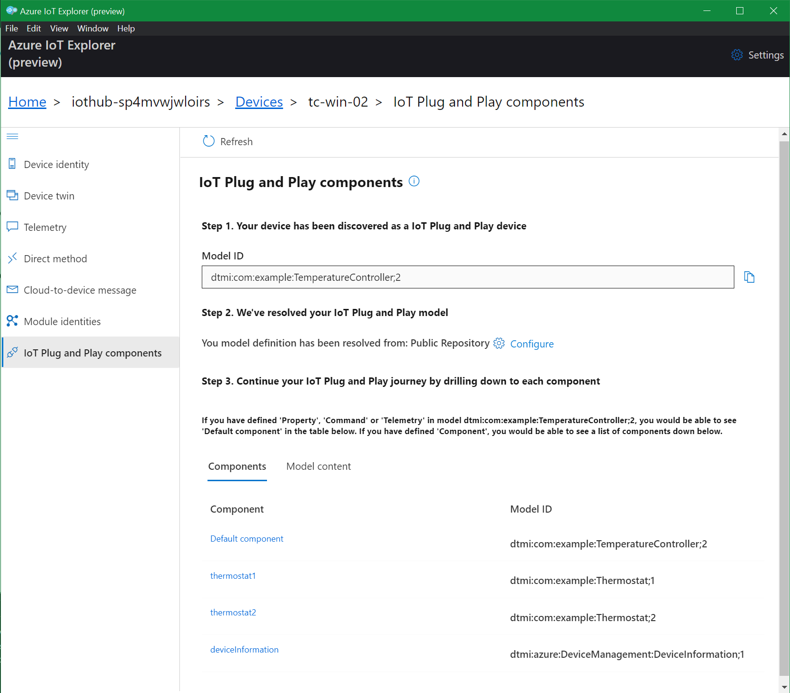
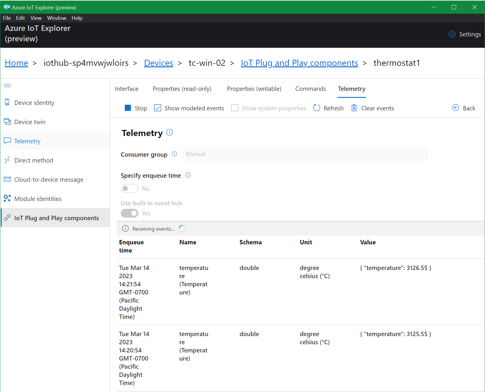
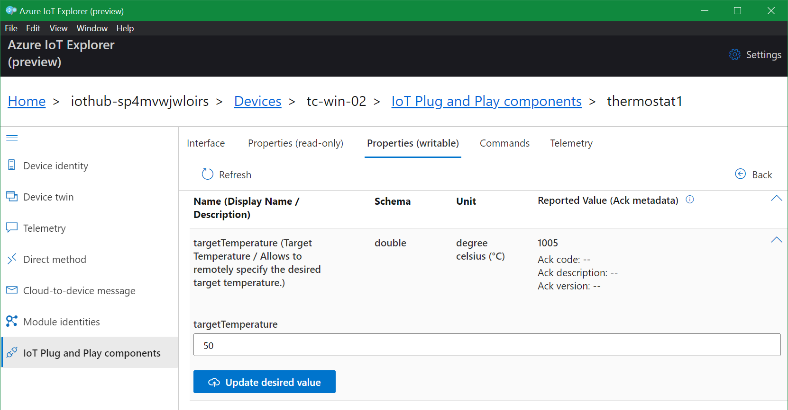
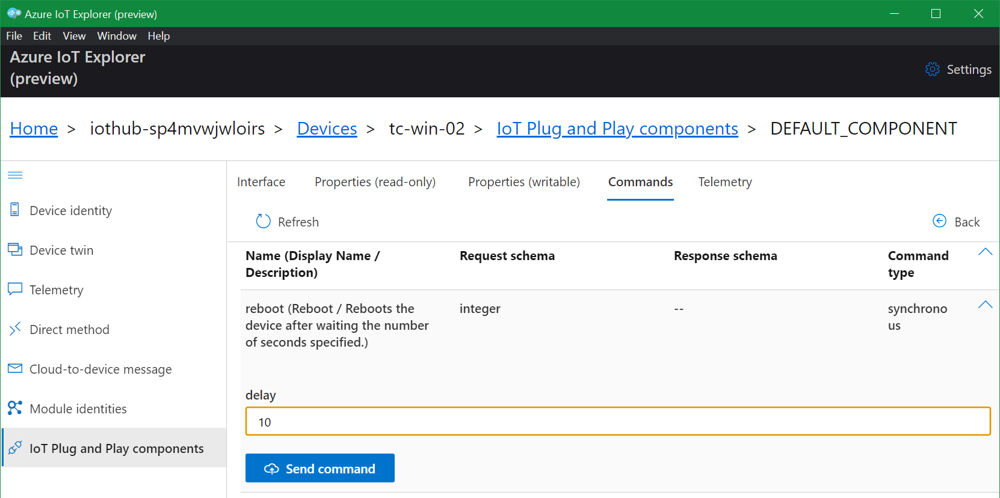

# Getting started with Azure IoT Hub and IoT Plug-and-Play

Azure IoT boasts a rich collection of tools and services you can use to connect
your IoT devices to the cloud. From there, the universe of Azure services is
available to build powerful business solutions.

It's also pretty complex. In this Getting Started guide, I wanted to distill down
and simplify the pathways I use to bring up proofs-of-concept and prototype projects quickly.

## Prerequisites

* **Azure Subscription**. Of course, you'll need an Azure Subscription. [Sign up for a free account](https://azure.microsoft.com/en-us/free/) to get started.
* **Azure CLI**. Install the [Azure Command-Line Interface](https://learn.microsoft.com/en-us/cli/azure/install-azure-cli) on your development PC.
* **Azure IoT CLI Extension**. Then install the [Azure IoT extension](https://github.com/Azure/azure-iot-cli-extension).
* **Azure IoT Explorer**. Grab the [Azure IoT Explorer](https://learn.microsoft.com/en-us/azure/iot-fundamentals/howto-use-iot-explorer) for a really handy way to visualize and interact with your devices.
* **Powershell**. All examples here run in PowerShell. Handily, you can [Install PowerShell](https://learn.microsoft.com/en-us/powershell/scripting/install/installing-powershell?view=powershell-7.3) on prettymuch anything these days! 
* **.NET 7 SDK**. All my examples are in C# on .NET. Get the [.NET 7.0 SDK](https://dotnet.microsoft.com/en-us/download/dotnet/7.0) to build and run the code examples.

## Bring up Services

Can I give you a pro tip for dealing with Azure services? **Always** bring up services
using an Azure Resource Manager (ARM) template. This way you'll always have a record
of what you tried, what worked, what didn't work, and what is the configuration you
finally wanted to run with. Check these into source control for an unlimited history
of your experiments. Once you're finished, you can be certain the services will
always be created exactly correctly, no guessing.

The current set of templates and scripts are in my `AzDevice.IoTHubWorker` project,
specifically the `.azure/deploy` directory.

### Create Resource Group

1. In a powershell window, change to the `.azure/deploy` directory.
2. Set `$env:RESOURCEGROUP` to the name of a resource group which does not yet exist in your Azure subscription
3. Run `Create-ResourceGroup.ps1`

This uses the Azure CLI to create a new resource group:
```powershell
az group create --name $env:RESOURCEGROUP --location "West US 2"
```

### Deploy IoT Hub & DPS Services

1. Run `Deploy-Services.ps1`

This deploys an ARM template to create a new Azure IoT Hub and Device Provisioning Services instance 
in your resource group:
```powershell
az deployment group create --name "HubDps-$(Get-Random)" --resource-group $env:RESOURCEGROUP --template-file "azuredeploy.json"
```

The outputs from this deployment will include several configuration values which you'll
need to make note of for further steps.

```json
    "outputs": {
      "$env:DPSNAME": {
        "type": "String",
        "value": "dps-redacted"
      },
      "$env:HUBCSTR": {
        "type": "String",
        "value": "HostName=iothub-redacted.azure-devices.net;SharedAccessKeyName=iothubowner;SharedAccessKey=redacted/redacted="
      },
      "$env:HUBNAME": {
        "type": "String",
        "value": "iothub-redacted"
      },
      "$env:IDSCOPE": {
        "type": "String",
        "value": "0ne00redacted"
      }
    },
```

### Save Environment Vars

This is a great time to keep track of your environment configuration by creating an 
environment variables file. Copy the `.env.template.ps1` file over to your own file,
e.g. `env.ps1`. Then fill in the values with the ones shown as `outputs` from your
deployment.

The remaining scripts rely on these variables being set, as well as contributing
new variables.

### Create an Enrollment Group

1. Run `Create-EnrollmentGroup.ps1` 

This creates a [symmetric key enrollment group](https://learn.microsoft.com/en-us/azure/iot-dps/how-to-legacy-device-symm-key?tabs=windows&pivots=programming-language-csharp) in the Device Provisioning Service. Using this will make it super easy to add new devices later.
```powershell
# Generate keys
$env:PK = [Convert]::ToBase64String([System.Text.Encoding]::Unicode.GetBytes("$(Get-Random)/$(Get-Random)"))
$env:SK = [Convert]::ToBase64String([System.Text.Encoding]::Unicode.GetBytes("$(Get-Random)/$(Get-Random)"))

# Create the enrollment group
$EnrollmentId = "devices"
az iot dps enrollment-group create -g $env:RESOURCEGROUP --dps-name $env:DPSNAME --enrollment-id $EnrollmentId --primary-key $env:PK --secondary-key $env:SK
```

Be sure to add `$env:PK` and `$env:SK` to your environment variables file.

## Enroll a Device

At this point, our services are all set up and ready to go. What's left is to enroll the specific device
we're using (our development PC in this case) into the service.

### Compute Device Key

1. Set `$env:DEVICEID` to the name you'd like to use for the device you're enrolling
2. Run `Compute-DeviceKey.ps1`

This creates a unique key for this device to connect to the enrollment group you've already
created:
```powershell
az iot dps enrollment-group compute-device-key --key $env:PK --registration-id $env:DEVICEID
```

### Generate Device Config (config.toml)

All of the device-side configuration goes into `config.toml`, using the format that Azure IoT Edge
expects for device configuration. Using the same format for all applications makes it easy to 
move to Azure IoT Edge later.

1. Run `Generate-DeviceConfig.ps1`

This script uses `config.template.toml` as a template to generate a unique `config.toml` for this device,
by replacing the needed tokens with correct values based on your solution.

## Build/Run Device Software

To get started quickly, you can follow along with the `TemperatureController` example device software from the `AzDevice.IoTHubWorker` project.
This example implements the [dtmi:com:example:TemperatureController;2](https://github.com/Azure/iot-plugandplay-models/blob/main/dtmi/com/example/temperaturecontroller-2.json) interface from the official [Azure/iot-plugandplay-models repository](https://github.com/Azure/iot-plugandplay-models).
Along the way, you can see how [IoT Plug and Play](https://learn.microsoft.com/en-us/azure/iot-develop/overview-iot-plug-and-play) is a powerful tool for IoT application
development.

### Place config file

1. Change directory to `examples/TemperatureController` for the remaining steps
2. Copy the config file from the previous steps, `.azure/deploy/config.toml`, to this directory.

### Build & Run

Once the device configuration is in place, simply run the app. It will pick up the configuration,
connect, and immediately start working with IoT Hub.

```
PS AzDevice-IotHubWorker\examples\TemperatureController> dotnet run
Building...
<6>AzDevice.IoTHubWorker[100] Started OK
<6>AzDevice.IoTHubWorker[200] Initial State: OK Applied 5 keys
<6>AzDevice.IoTHubWorker[101] Device: Example Thermostat Controller S/N:1234567890-ABCDEF ver:local-6759b72 dtmi:com:example:TemperatureController;2
<6>Microsoft.Hosting.Lifetime[0] Application started. Press Ctrl+C to shut down.
<6>Microsoft.Hosting.Lifetime[0] Hosting environment: Production
<6>Microsoft.Hosting.Lifetime[0] Content root path: \AzDevice-IotHubWorker\examples\TemperatureController
<6>AzDevice.IoTHubWorker[300] Provisioning: OK. Device redacted-01 on Hub iothub-redacted.azure-devices.net
<6>AzDevice.IoTHubWorker[400] Connection: OK.
<6>AzDevice.IoTHubWorker[500] Telemetry: OK 3 messages
```

If everything was configured correctly, you'll see your device name connected to the hub you just created.

## View Device in IoT Explorer

The Azure IoT Explorer makes it easy to find our devices and communicate with them. Because we're using
an IoT Plug-and-Play model, the Explorer automatically creates UI to interact with our device in the
way we've described in the DTMI model. It knows what telemetry to expect, which commmands we can send,
which properties we can view, and which properties we can change. 

This all makes it an incredibly powerful tool for deployment. We can first create our interface based
on the problem domain. Then develop to fulfill that interface while using IoT Explorer as a front-end.
Finally, we can integrate the back-end services once we have a device we know is working correctly.

To get started:

1. Launch the Azure IoT Explorer
2. Grab your IoT Hub Connection String `$env:HUBCSTR` from your environment vars
3. Choose `Add connection`
4. Enter the IoT Hub Connection String into the `Connection string` text box.
5. Press `Save`
6. Then, back on the main page, `-> View devices in this hub`
7. Click the name of the device you previously provisioned and connected
8. Click "IoT Plug and Play components" in the left-side navigation menu

This brings up the IoT Plug and Play components screen for this device. From here, you can interact with the device according to the capabilities exposed in the IoT Plug and Play interface.



## View Telemetry

To watch the telemetry flow in, pick the `Telemetry` screen from the `thermostat1` component, then check the `Show modeled events`,
box and click `Start`. As telemetry is reported, you'll see it here.



## View/Set Properties

You can check out the latest reported state of properties on the `Properties (read-only)` screen, as well as set writable properties to new values on the `Properties (writable)` screen



Note that when you update values, this will show up in the device software logs as well:

```
<6>AzDevice.IoTHubWorker[710] Property: Component OK. Updated thermostat1.targetTemperature to 50
```

## Send Commands

Finally, you can send commands to the device. For example, from the `Default component`, you can send the
`reboot`



The device software in this example will accept the reboot command, log it, and then proceed to ignore it.

```
<6>AzDevice.IoTHubWorker[600] Command: OK reboot Response: {}
```

## What's next

From here, you might be interested to...

* [Install a .NET Worker Service on Linux](/docs/InstallOnLinux.md)
* [Package a .NET Worker Service as a DEB](/docs/PackageAsDeb.md)
* [Send data to Azure IoT Hub from a physical Temperature/Humidity Sensor running on Raspberry Pi](/docs/RunOnRPi.md)

Future articles in the series will cover...

* Connect a Modbus sensor to Azure IoT Hub 
* Explore the Azure IoT Device Worker using different device models
* Create your OWN device model
* Use Azure Pipelines to create a Continous Integration workflow deploying deb packages to a private deb repository
* Use Azure IoT Edge as an intelligent gateway
  