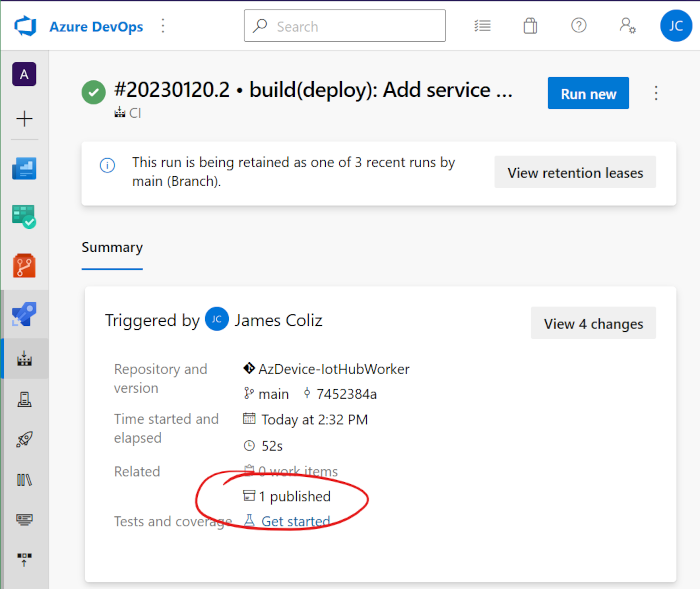
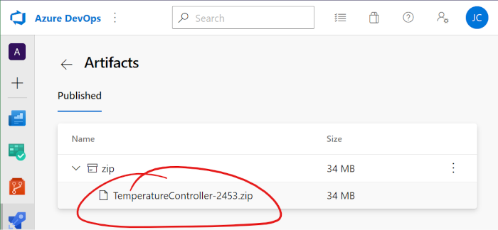

# Installing a .NET Worker Service on Linux

## Prerequisite: A .NET Worker Service 

This article assumes you already have a worker service running, and now it's time to run on Linux.
You can follow along with the TemperatureController example, which employs my Azure IoT Device Worker
service. However, these steps will work fine for any worker service.

Check out [Worker Services in .NET](https://learn.microsoft.com/en-us/dotnet/core/extensions/workers) for all the details.

## Configure Host Service for SystemD

You'll need to add `UseSystemd' to your host builder. For example, here's mine:

```c#
IHost host = Host.CreateDefaultBuilder(args)
    .UseSystemd() 
    .ConfigureServices(services =>
    {
        services.AddHostedService<IoTHubWorker>();
        services.AddSingleton<IRootModel>(new ControllerModel());
    })
    .ConfigureHostConfiguration(config =>
    {
        config.AddTomlFile("config.toml", optional: true, reloadOnChange: true);
        config.AddJsonFile("version.json", optional: true, reloadOnChange: true);
    })
    .Build();
```

This requires adding the [Microsoft.Extensions.Hosting.Systemd](https://www.nuget.org/packages/Microsoft.Extensions.Hosting.Systemd) package to the application.

## Publish self-contained to linux-x64 runtime

Now, we'll publish the worker to the `linux-x64` runtime. I prefer to publish self-contained to cut down
on the dependencies needing to be managed later on.

```
PS> dotnet publish --configuration Release --runtime linux-x64 --self-contained --output publish_output

MSBuild version 17.4.1+9a89d02ff for .NET
  Determining projects to restore...
  Restored C:\Source\jcoliz\AzDevice-IotHubWorker\src\AzDevice.IoTHubWorker\AzDevice.IoTHubWorker.csproj (in 421 ms).
  Restored C:\Source\jcoliz\AzDevice-IotHubWorker\examples\TemperatureController\TemperatureController.csproj (in 427 m
  s).
  AzDevice.IoTHubWorker -> C:\Source\jcoliz\AzDevice-IotHubWorker\src\AzDevice.IoTHubWorker\bin\Release\net7.0\AzDevice
  .IoTHubWorker.dll
  TemperatureController -> C:\Source\jcoliz\AzDevice-IotHubWorker\examples\TemperatureController\bin\Release\net7.0\lin
  ux-x64\TemperatureController.dll
  TemperatureController -> C:\Source\jcoliz\AzDevice-IotHubWorker\examples\TemperatureController\publish_output\
```

## Use WSL to try it out locally (optional)

If you have the Windows Subsystem for Linux installed on your development machine, you can quickly switch 
over to that and ensure it runs correctly on Linux. 

```
PS> cd .\publish_output\ 
PS> wsl
jcoliz@Beach:/mnt/c/Source/jcoliz/AzDevice-IotHubWorker/examples/TemperatureController/publish_output$ ./TemperatureController

<6>AzDevice.IoTHubWorker[100] Started OK
<6>AzDevice.IoTHubWorker[200] Initial State: OK Applied 5 keys
<6>AzDevice.IoTHubWorker[101] Device: Example Thermostat Controller S/N:1234567890-ABCDEF ver:local-141c054 dtmi:com:example:TemperatureController;2
<6>AzDevice.IoTHubWorker[300] Provisioning: OK. Device tc-01 on Hub iothub-sp4mvwjwloirs.azure-devices.net
<6>AzDevice.IoTHubWorker[400] Connection: OK.
<6>AzDevice.IoTHubWorker[2300] Property: Component OK. Updated thermostat1.targetTemperature to 5000
<6>AzDevice.IoTHubWorker[2300] Property: Component OK. Updated thermostat2.targetTemperature to 100
```

## Package into a ZIP file

Next, we gather up the published output into a ZIP file to move it over to our Linux target device.

```
PS> Compress-Archive -Path .\publish_output\* -DestinationPath TemperatureController.zip
```

## Set up your Azure Pipelines to build the ZIP automatically (optional)

Better yet, set up your Continuous Integration pipeline to automatically build and package a Linux
version every time you commit code.

Here are steps from my Azure Pipeline to build a zip with each CI build.

```yaml
steps:
- task: DotNetCoreCLI@2
  displayName: 'Publish app'
  inputs:
    command: publish
    arguments: '--configuration Release --runtime linux-x64 --self-contained --output publish_output'
    projects: '$(appdir)/*.csproj'
    publishWebProjects: false
    modifyOutputPath: false
    zipAfterPublish: false

- task: ArchiveFiles@2
  displayName: "Archive files"
  inputs:
    rootFolderOrFile: "$(System.DefaultWorkingDirectory)/publish_output"
    includeRootFolder: false
    archiveFile: $(Build.ArtifactStagingDirectory)/$(application)-$(Build.BuildId).zip
    replaceExistingArchive: true
    archiveType: zip

- task: PublishBuildArtifacts@1
  inputs:
    PathtoPublish: $(Build.ArtifactStagingDirectory)/$(application)-$(Build.BuildId).zip
    artifactName: 'zip'
```

This file can be downloaded from the 'artifacts' from any particular build.




## Copy ZIP file onto target machine

Copy that file over to the machine where we'll be running...

```
PS> scp TemperatureController.zip james@brewbox:
TemperatureController.zip                                                             100%   33MB 350.1KB/s   01:37
```

## Set up local config on the target machine (as needed)

If you're following along with this article using my Azure IoT Device Worker examples,
you'll need to generate a NEW device identity for the target device. 
**Don't re-use device identities on multiple machines!** 
IoT Hub gets confused, leading to undefined results.

Generate a new `config.toml`, using a new device ID as explained in (TODO:link). Then copy this file over.

```
PS> scp config.toml james@brewbox:
config.toml                                                                           100%  283     9.9KB/s   00:00
```

Otherwise, for your own .NET Worker applications on Linux, copy over any machine-specific configuration you need
on the target device.

## Unpack the file into /opt/{packagename}

On the target device, I like to put everything into /opt.

```bash
PS> ssh james@brewbox
james@brewbox:~$ sudo unzip TemperatureController.zip -d /opt/TemperatureController

```

Also copy over the local config if you needed that

```bash
james@brewbox:~$ sudo cp config.toml /opt/TemperatureController

```

## Run in place on target machine

First, let's ensure everything is working on the target machine by just running it directly:

```
james@brewbox:~$ cd /opt/TemperatureController/
james@brewbox:/opt/TemperatureController$ ./TemperatureController

<6> AzDevice.IoTHubWorker[100] Started OK
<6> AzDevice.IoTHubWorker[102] Model: dtmi:com:example:TemperatureController;2
<6> AzDevice.IoTHubWorker[200] Initial State: OK Applied 6 keys
<6> AzDevice.IoTHubWorker[101] Device: Example.json Thermostat Controller.json 0.0.2
<6> Microsoft.Hosting.Lifetime[0] Application started. Press Ctrl+C to shut down.
<6> Microsoft.Hosting.Lifetime[0] Hosting environment: Production
<6> Microsoft.Hosting.Lifetime[0] Content root path: /opt/TemperatureController
<6> AzDevice.IoTHubWorker[300] Provisioning: OK. Device tc-01 on Hub iothub-sp4mvwjwloirs.azure-devices.net
<6> AzDevice.IoTHubWorker[400] Connection: OK.
```

## Install systemd unit file

The key magic which allows our worker to run as a systemd service is the Unit File. 
You can learn more about these files on the [systemd.unit man page](https://www.freedesktop.org/software/systemd/man/systemd.unit.html)/

This example comes with one already packaged. Here's what mine looks like. Pretty simple stuff!

```ini
[Unit]
Description=Temperature Controller

[Service]
Type=notify
WorkingDirectory=/opt/TemperatureController
ExecStart=/opt/TemperatureController/TemperatureController

[Install]
WantedBy=multi-user.target
```

This goes into `/etc/systemd/system`, and then reload the daemon:

```
james@brewbox:~$ sudo cp /opt/TemperatureController/tempcontroller.service /etc/systemd/system
james@brewbox:~$ sudo systemctl daemon-reload
```

## Start the service

Now we're ready to start the service! It's pretty easy. And in true UNIX fashion, it succeeds silently.

```
james@brewbox:~$ sudo systemctl start tempcontroller
```

## Check the status

How do you know it worked? Check the status!

```
james@brewbox:~$ sudo systemctl status tempcontroller

● tempcontroller.service - Temperature Controller
     Loaded: loaded (/etc/systemd/system/tempcontroller.service; enabled; vendor preset: enabled)
     Active: active (running) since Thu 2023-01-19 20:10:35 PST; 31s ago
   Main PID: 17626 (TemperatureCont)
      Tasks: 26 (limit: 9228)
     Memory: 35.0M
     CGroup: /system.slice/tempcontroller.service
             └─17626 /opt/TemperatureController/TemperatureController

Jan 19 20:10:34 brewbox TemperatureController[17626]: AzDevice.IoTHubWorker[102] Model: dtmi:com:example:TemperatureController;2
Jan 19 20:10:34 brewbox TemperatureController[17626]: AzDevice.IoTHubWorker[200] Initial State: OK Applied 6 keys
Jan 19 20:10:34 brewbox TemperatureController[17626]: AzDevice.IoTHubWorker[101] Device: Example.json Thermostat Controller.json 0.0.2
Jan 19 20:10:35 brewbox TemperatureController[17626]: Microsoft.Hosting.Lifetime[0] Application started. Hosting environment: Production; Content root path: /opt/TemperatureController
Jan 19 20:10:35 brewbox systemd[1]: Started Temperature Controller.
Jan 19 20:11:03 brewbox TemperatureController[17626]: AzDevice.IoTHubWorker[300] Provisioning: OK. Device tc-01 on Hub iothub-sp4mvwjwloirs.azure-devices.net
Jan 19 20:11:03 brewbox TemperatureController[17626]: AzDevice.IoTHubWorker[400] Connection: OK.
Jan 19 20:11:04 brewbox TemperatureController[17626]: AzDevice.IoTHubWorker[2300] Property: Component OK. Updated thermostat1.targetTemperature to 5000
Jan 19 20:11:04 brewbox TemperatureController[17626]: AzDevice.IoTHubWorker[2300] Property: Component OK. Updated thermostat2.targetTemperature to 100
Jan 19 20:11:05 brewbox TemperatureController[17626]: AzDevice.IoTHubWorker[500] Telemetry: OK 3 messages

```

## Search the logs

If you need more detailed logging that just the most recent logs shown in the status, you can use `journalctl`. 
Optionally include the `-g` option to grep for only certain lines.

```
james@brewbox:~$ sudo journalctl -u tempcontroller -g 400

-- Logs begin at Fri 2021-12-10 01:04:02 PST, end at Fri 2023-01-20 12:09:23 PST. --
Jan 19 18:00:32 brewbox TemperatureController[3929]: AzDevice.IoTHubWorker[400] Connection: OK.
Jan 19 18:03:15 brewbox TemperatureController[4000]: AzDevice.IoTHubWorker[400] Connection: OK.
Jan 19 18:15:02 brewbox TemperatureController[4204]: AzDevice.IoTHubWorker[400] Connection: OK.
Jan 19 20:11:03 brewbox TemperatureController[17626]: AzDevice.IoTHubWorker[400] Connection: OK.
-- Reboot --
Jan 20 08:36:20 brewbox TemperatureController[717]: AzDevice.IoTHubWorker[400] Connection: OK.
```

## Stop the service

When you're done, stopping the service is just as easy as starting it.

```
james@brewbox:~$ sudo systemctl stop tempcontroller
james@brewbox:~$ sudo systemctl status tempcontroller

● tempcontroller.service - Temperature Controller
     Loaded: loaded (/etc/systemd/system/tempcontroller.service; enabled; vendor preset: enabled)
     Active: inactive (dead) since Thu 2023-01-19 20:13:10 PST; 27s ago
    Process: 17626 ExecStart=/opt/TemperatureController/TemperatureController (code=exited, status=0/SUCCESS)
   Main PID: 17626 (code=exited, status=0/SUCCESS)
```

## Next up: Build into a DEB package!

Packaging as a ZIP is ok, but better still would be integrating with the Debian package manager system.
That's next!