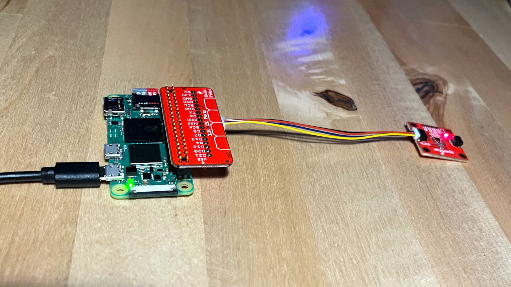
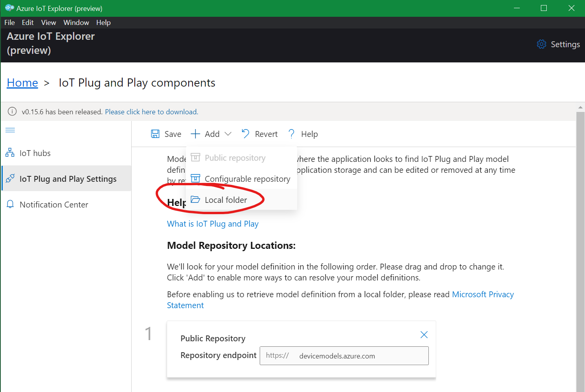
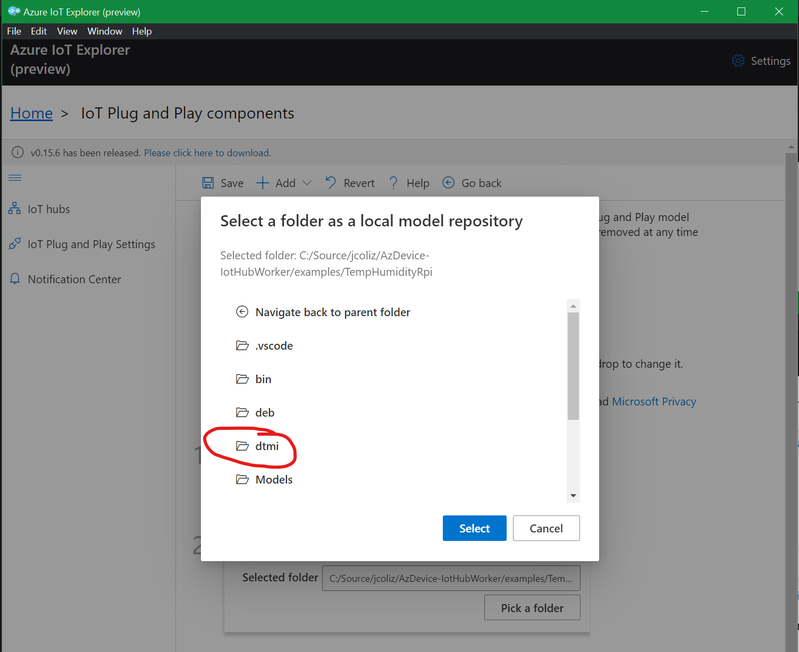
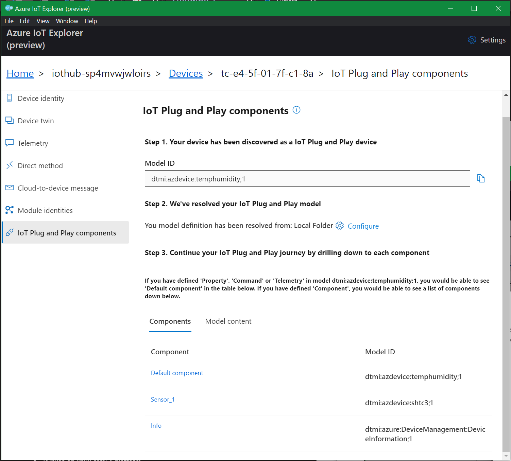
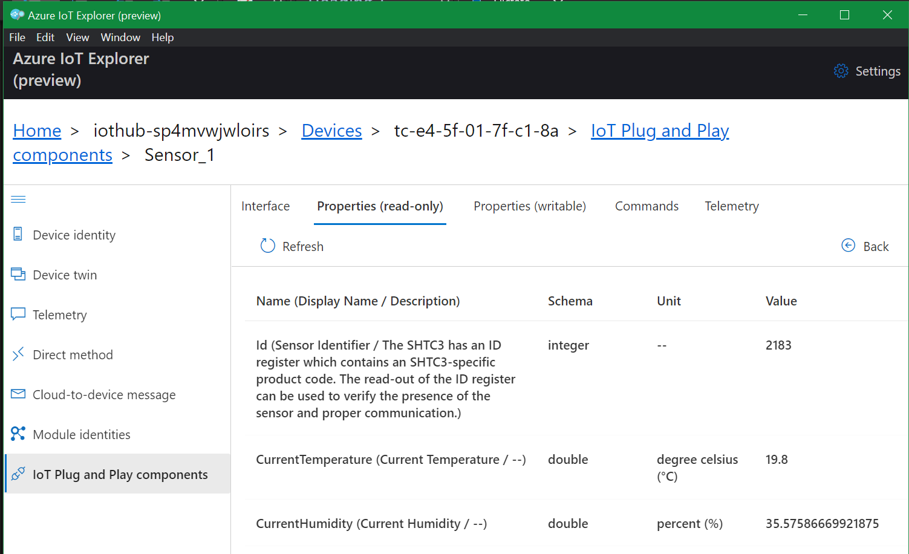
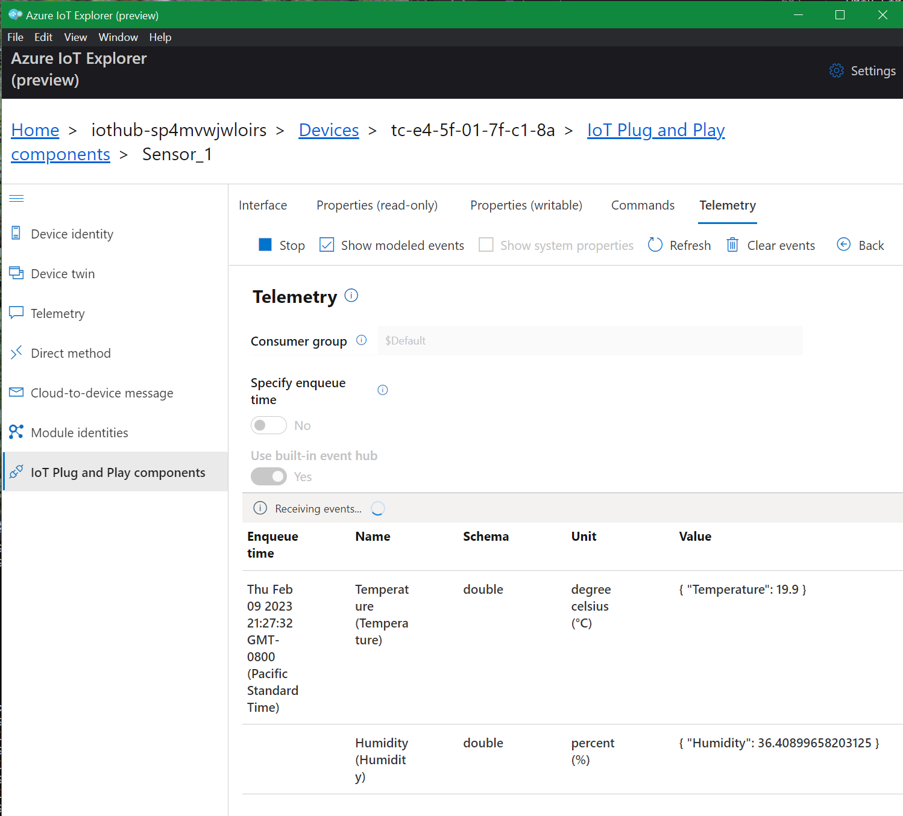
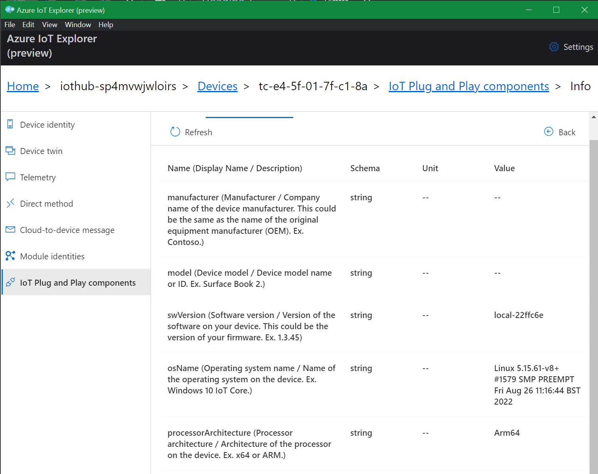

# Send data to Azure IoT Hub from a physical Temperature/Humidity Sensor running on Raspberry Pi 



This guide demonstrates how to model a physical temperature & humidity sensor with IoT Plug and Play, 
run on a Raspberry Pi, and send data from this sensor to Azure IoT Hub.

## Bill of Materials

The SparkFun Qwiic system is a handy way to quickly and reliably connect parts which use
the I<sup>2</sup>C bus. I highly recommend it for getting started. Here are the parts I'm using in this
example. While I like the Pi Zero for its price and compact form factor, any RPi should 
work fine for this.

* Raspberry Pi Zero 2 W (DEV-18713) $15
* SparkFun Qwiic HAT for Raspberry Pi (DEV-14459) $6.50
* SparkFun Humidity Sensor Breakout - SHTC3 (Qwiic) (SEN-16467) $11
* Raspberry Pi Power Supply, SoulBay 5V 3A Micro USB AC Adapter $11
* Flexible Qwiic Cable - 100mm (PRT-17259) $1.60

These parts are very easy to connect together. Have a look at the picture above if it's not obvious!

## Prepare Your Raspberry Pi

### Install Raspberry Pi OS

I recommend to configure your Rasperry Pi as a headless device. The 
[Raspberry Pi Imager](https://www.raspberrypi.com/documentation/computers/getting-started.html#using-raspberry-pi-imager)
makes it easy to do that.

Some recommendations:
* Image: Raspberry Pi OS Lite (64-bit)
* WiFi Config: Set it up with your SSID & wifi password
* SSH: Allow public key auth only. Paste in a public key for this device

### Install dotnet runtime

Once your device is up and running, you'll want to install the .NET runtime. Sadly, Microsoft doesn't
publish ARM64 packages for dotnet components. Instead, you can use the [dotnet-install script](https://learn.microsoft.com/en-us/dotnet/core/tools/dotnet-install-script) to pull down the latest runtime(s).

Here's my recommended usage to install for system-wide usage. Install both the 6.0 and 7.0
runtimes for maximum compatibility.

```
$ sudo ./dotnet-install.sh --runtime dotnet --channel 7.0 --install-dir /opt/dotnet
$ sudo ./dotnet-install.sh --runtime dotnet --channel 6.0 --install-dir /opt/dotnet
```

Then, create `/etc/profile.d/dotnet.sh` with these contents:

```
export DOTNET_ROOT=/opt/dotnet
export PATH=$PATH:/opt/dotnet
```

NOTE: If you choose a different installation directory from what's shown here, you'll need to change the 
DEB package control file before building the DEB package later on in this guide.

### Enable the I<sup>2</sup>C bus

Use the [raspi-config](https://www.raspberrypi.com/documentation/computers/configuration.html) tool
to enable the I<sup>2</sup>C bus. This is under "Interfacing Options" in the main tree.

```
$ sudo raspi-config
```

## Test the Hardware

Next up, let's ensure that everything is correctly set up and working with dotnet. To do that,
compile, deploy, and run the appropriate [.NET device binding](https://github.com/dotnet/iot/tree/main/src/devices)
for the SHTC3 chip.

We'll do the development on a PC. I find development directly on the target hardware to be intolerably
slow. It's much faster to cross-compile on a development PC, then transfer files over.

### Clone the whole .NET IoT repository

```
PS> git clone https://github.com/dotnet/iot.git
```

### Build the SHTC3 sample

```
PS> cd iot/tree/main/src/devices/Shtc3/samples
PS> dotnet build
```

### Publish for ARM64

```
PS> dotnet publish --configuration Release --runtime linux-arm64 --no-self-contained --output bin\publish_output\Shtc3
```

### Copy to target device
Obviously, replace `user@hostname` with your login user and your target device's hostname.

```
PS> scp -r .\bin\publish_output\Shtc3\ user@hostname:
```

### Run the sample
First, SSH to the target device, then run the sample:

```
$ dotnet Shtc3/Shtc3.Samples.dll
Sensor Id: 2183
====================In normal power mode===========================
Temperature: 19.8°C
Humidity: 35.1%
Heat index: 18.8°C
Dew point: 3.9°C
====================In low power mode===========================
Temperature: 20.1°C
Humidity: 35.9%
Heat index: 19.1°C
Dew point: 4.5°C
```

This means our hardware is working great.

## Deploy Azure IoT Hub with Device Provisioning Service

Follow the [Getting Started](./GettingStarted.md) guide to bring up your Azure IoT Hub and DPS services
if they're not already running.

Once you already have that going, create a new `config.toml` file with device-specific provisioning information for the new
target device.

Here's my quick process for provisioning a new device, based on the scripts from the Getting Started guide. Ensure your
environment variables are all set correctly as described there. For the device name, I use the application
being run plus the MAC address of the device.

```
PS> cd .azure/deploy
PS> $env:DEVICEID="shtc3-ab-cd-ef-01-02-03"
PS> ./Compute-DeviceKey.ps1
PS> ./Generate-DeviceConfig.ps1
PS> scp config.toml user@hostname:
```

## Build the Application Software

The AzDevice-IoTHubWorker repo contains a pre-built example for connecting an SHTC3 sensor to 
Azure IoT Hub, using an IoT Plug and Play model. Let's clone the repo, then build and deploy that
example.

```
PS> git clone https://github.com/jcoliz/AzDevice-IoTHubWorker.git
PS> cd AzDevice-IoTHubWorker/examples/TempHumidityRpi
PS> dotnet build
```

Next up, we'll package it as a DEB file, and transfer it over to the target device. 
Note that I use the [Windows Subsystem for Linux](https://learn.microsoft.com/en-us/windows/wsl/install) 
to do this, which makes it super easy to run the `dpkg` tools on Linux. If you spend any
time developing on Windows to target Linux devices, I highly recommend having this set up.

```
PS> deb/Publish.ps1
PS> scp bin/TempHumidityRpi_0.0.0-local-*_arm64.deb user@hostname:
```

Alternately, you could use the same publish/copy process we used above for the device binding sample.

```
PS> dotnet publish --configuration Release --runtime linux-arm64 --no-self-contained --output bin\publish_output\TempHumidityRpi
PS> scp -r .\bin\publish_output\TempHumidityRpi\ user@hostname:
```

## Install & Configure the Package

Back on the target device, we'll need to install it:

```
$ sudo apt install ./TempHumidityRpi_0.0.0-local-*_arm64.deb
```

Because we're running with a true physical sensor, as opposed to a
fake simulated sensor, we need to configure the application to pull data
from that physical sensor. Otherwise, it will generate simulated data,
which we don't need in this case.

Add these lines to the end of the `config.toml`:

```
[InitialState.Sensor_1]
Physical = true
```

Then copy our configuration file into place:

```
$ sudo cp config.toml /opt/TempHumidityRpi
```

We're now ready to start up the example and watch the data flow to Azure IoT.

## Run it!

```
$ sudo systemctl start temphumidity
$ sudo systemctl status temphumidity
```

```
● temphumidity.service - Temperature+Humidity Example
     Loaded: loaded (/etc/systemd/system/temphumidity.service; disabled; vendor preset: enabled)
     Active: active (running) since Thu 2023-02-09 20:58:15 PST; 10s ago
   Main PID: 1474 (TempHumidityRpi)
      Tasks: 27 (limit: 191)
        CPU: 9.791s
     CGroup: /system.slice/temphumidity.service
             └─1474 /opt/TempHumidityRpi/TempHumidityRpi

Feb 09 20:58:14 hostname TempHumidityRpi[1474]: AzDevice.IoTHubWorker[100] Started OK
Feb 09 20:58:14 hostname TempHumidityRpi[1474]: AzDevice.IoTHubWorker[200] Initial State: OK Applied 3 keys
Feb 09 20:58:14 hostname TempHumidityRpi[1474]: AzDevice.IoTHubWorker[101] Device: S/N:1234-5678 ver:local-22ffc6e sensor:Physical SHTC3 ID#2183
Feb 09 20:58:14 hostname TempHumidityRpi[1474]: AzDevice.IoTHubWorker[102] Model: dtmi:azdevice:temphumidity;1
Feb 09 20:58:15 hostname TempHumidityRpi[1474]: Microsoft.Hosting.Lifetime[0] Application started. Hosting environment: Production; Content root path: /opt/TempHumidityRpi
Feb 09 20:58:15 hostname systemd[1]: Started Temperature+Humidity Example.
Feb 09 20:58:20 hostname TempHumidityRpi[1474]: AzDevice.IoTHubWorker[300] Provisioning: OK. Device shtc3-ab-cd-ef-01-02-03 on Hub iothub-abc0123456789.azure-devices.net
Feb 09 20:58:21 hostname TempHumidityRpi[1474]: AzDevice.IoTHubWorker[400] Connection: OK.
Feb 09 20:58:24 hostname TempHumidityRpi[1474]: AzDevice.IoTHubWorker[500] Telemetry: OK 1 messages
Feb 09 20:58:24 hostname TempHumidityRpi[1474]: AzDevice.IoTHubWorker[2100] Property: OK Reported 6 properties
```

Or if you copied the files over directly, you can launch it directly.

```
$ cp config.toml TempHumidityRpi
$ dotnet TempHumidityRpi/TempHumidityRpi.dll
```

Once you're all done later, you can stop the service, and/or remove it entirely:

```
$ sudo systemctl stop temphumidity
$ sudo apt remove temphumidityrpi
```

## View the Data in Azure IoT Explorer

The [Azure IoT Explorer](https://learn.microsoft.com/en-us/azure/iot-fundamentals/howto-use-iot-explorer) is the ideal tool
to interact with a device connected to Azure IoT--especially one running an IoT Plug and Play model. Download this tool,
and add your hub to the list of known hubs using the connection string to your hub.

If you followed the [Getting Started](./GettingStarted.md) guide precisely, you'll have the necessary IoT Hub connection
string sitting conveniently in the `$env:HUBCSTR` variable.

### Configure Local Folder source for DTMI models

One of the great benefits of the Azure IoT Explorer is that it will parse our DTMI models, then present the aspects
of our model using custom UI. To enable this, we need to tell the explorer where our models are located.

Choose `IoT Plug and Play Settings` from the left menu, then `(+) Add`, then `Local folder`.



Next, pick the `dtmi` subfolder under the `TempHumidityRpi` example.



### View IoT Plug and Play components

From the main screen, pick your hub, then pick your device, and choose `IoT Plug and Play components` from the
navigation menu on the left. This will confirm that the explorer was able to find the model correctly, and has parsed it,
showing you the various components in this model.



### Sensor Properties

Click into `Sensor_1`, then `Properties (read-only)` to see the latest state of the sensor:



### Sensor Telemetry

To watch the telemetry flow in, pick the `Telemetry` screen from the `Sensor_1` component, then check the `Show modeled events`,
box and click `Start`. As telemetry is reported, you'll see it here.



If you're impatient, you can tune how often telemetry is sent up by jumping over to the `Properties (writable)` screen for the `TelemtryPeriod` property. Enter something like `PT1S` to send telemetry every second.

### Device Information

Back out to the device screen, then pick the `Info` component and view its `Properties (read-only)` screen. You'll see the details about the device 
we've installed the sample onto.



You can verify that the `osName` property is the same as you'd expect by running `uname` on your target device:

```
$ uname -srv
```
